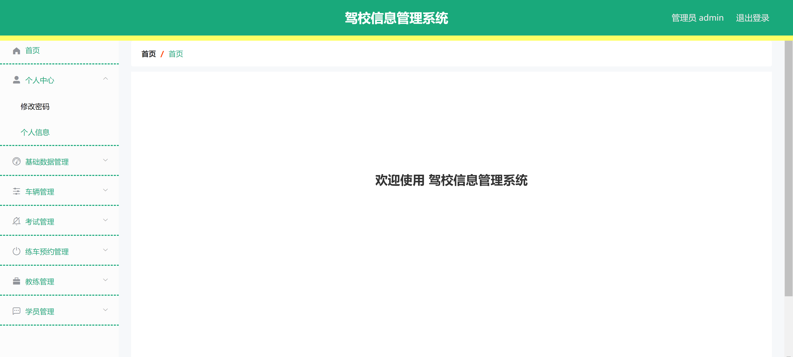
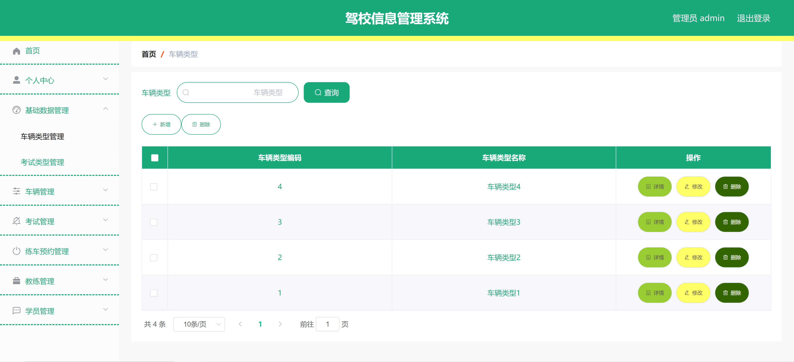
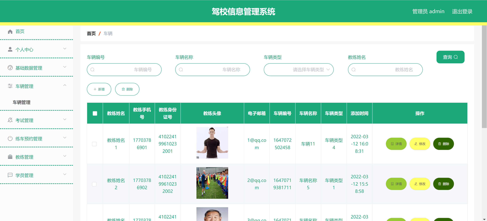
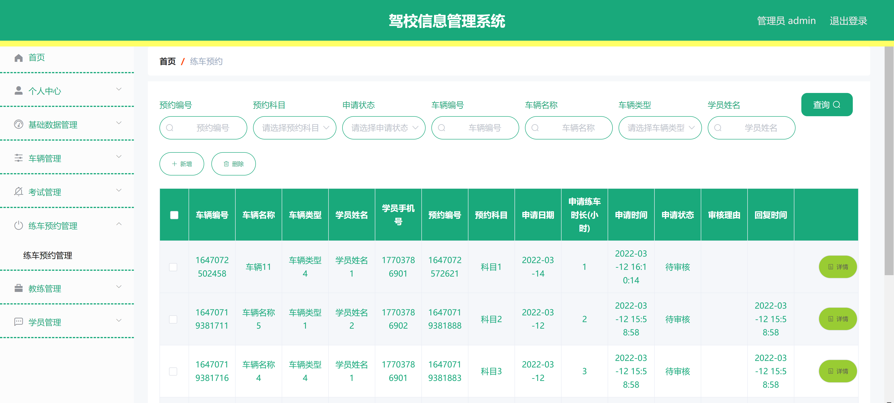
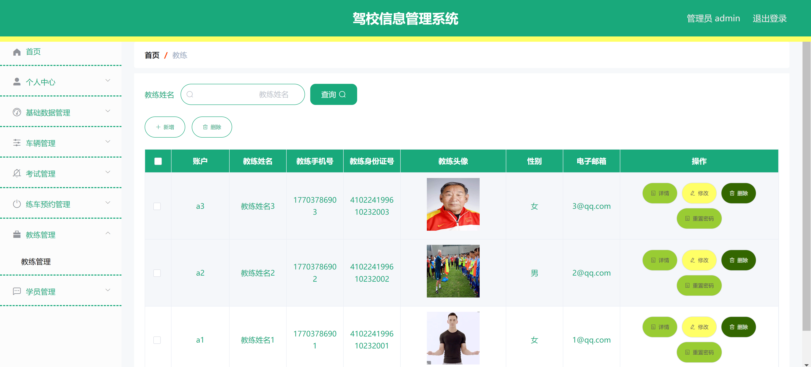

<h1 align="center">驾校信息管理系统</h1>

## 简介
驾校信息管理系统：角色分为管理员、教练、学员；功能包括学员管理、教练管理、课程安排、考试预约、车辆和财务管理，提升驾校管理效率和服务质量。    --计算机毕业设计源码；毕设源码；java毕业设计源码

## 联系方式

<h3 align="center">获取完整代码与数据库文件 + 微信：bysj5151 QQ: 86050149 QQ群: 783742310</h3>

<h3 align="center">可帮忙远程部署 包运行成功！提供远程部署、修改代码、设计文档指导、代码讲解等服务！</h3>

## 功能介绍（完整见运行截图）
管理员：基本功能包括进行用户登录和注册管理，管理系统各个模块如学员信息管理、教练信息管理、车辆管理、考试安排及预约管理。负责课程安排及调整，查看和编辑教练及学员的详细资料，并进行财务管理及费用记录统计，提高驾校管理效率并确保系统信息的集中处理。

教练：主要功能包括管理自身的教学安排及查看学员信息，通过驾校信息系统进行课程的安排与调整，并处理与学员预约考试相关的任务。可以访问系统中的个人资料，自行更新和管理与教学相关的信息内容。

学员：能够通过系统进行账户注册与个人信息管理，查看和预约课程，查看考试安排及完成考试预约。学员还能够查看自身的财务信息，确保如期缴纳相关费用以顺利进行驾驶培训。

系统访客：访客可以浏览登录页及注册页面，通过输入框填写基本信息创建新账户。通过系统首页访问驾校信息，了解系统提供的各项功能，支持选择角色进行进一步操作。

## 运行截图

本代码来源于网络,仅供学习参考使用!

